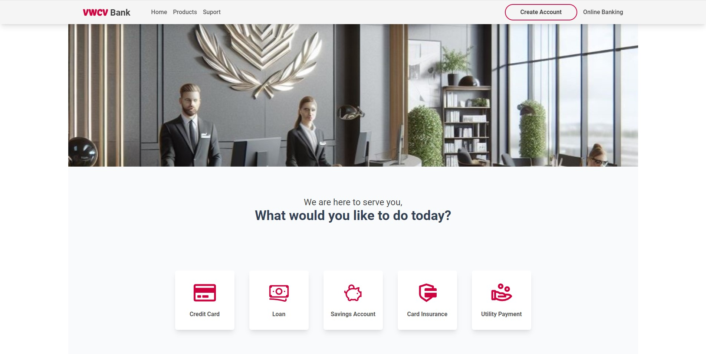
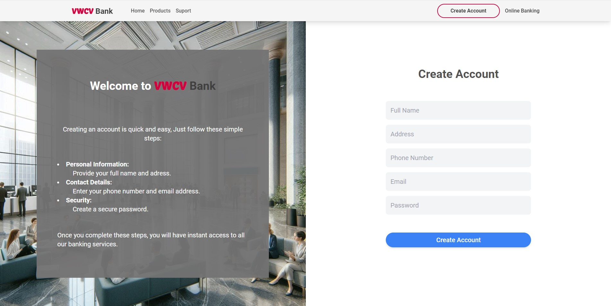
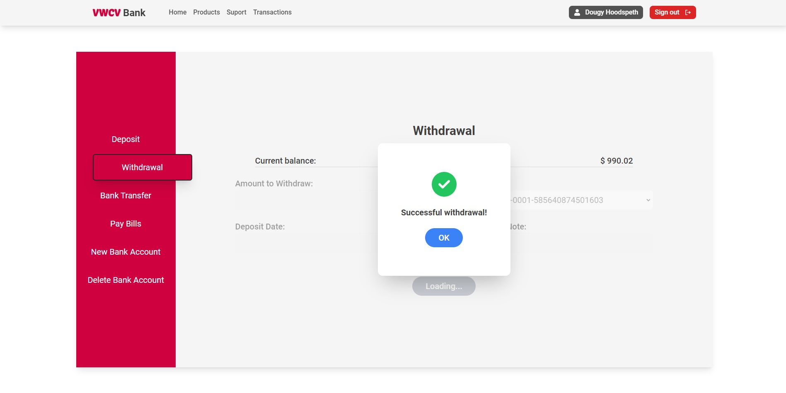
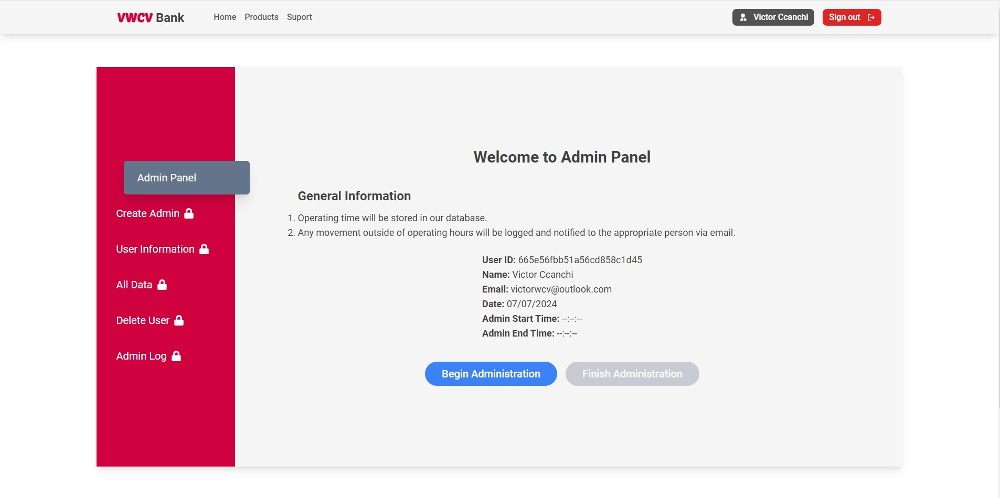

# The Banking Application

## Description/Motivation
The Banking Application was developed as part of the capstone project for obtaining the certificate from the MIT Full Stack Web Development with MERN program. This project replicates the functionality of a bank's web application, allowing users to manage their finances seamlessly. I have applied the knowledge acquired during the program to develop this application. The application supports user and admin roles, enabling bank employees (admins) to oversee transactions and users to manage their money, including deposits and withdrawals. Additionally, users have access to a dashboard to view their account balance and transaction history, among other functionalities.

### Key Benefits:
- **Target Users**: Individuals looking to manage their finances online and bank employees overseeing financial operations.
- **Purpose**: To provide a secure and efficient platform for online banking.
- **Problem Solved**: This application addresses the need for a digital banking solution that offers robust financial management tools and oversight capabilities for administrators.

## Deployment

The project is deployed and accessible at the following link:

[Demo Banking App](https://victorwcv.github.io/MIT-capstone-bank-app/)

## Api Documentation

For more detailed information about each endpoint, including request and response formats, please refer to the...

[API documentation on Swagger](https://mit-capstone-bank-app.onrender.com/api-docs/)

## Installation Guidelines

To get your project up and running, follow these steps:

1. **Clone the Repository:**
    ```bash
    git clone https://github.com/victorwcv/MIT-capstone-bank-app
    cd MIT-capstone-bank-app
    ```

2. **Install Server Dependencies:**
    ```bash
    cd server
    npm install
    ```

3. **Install Client Dependencies:**
    ```bash
    cd client
    npm install
    ```

4. **Set Up Environment Variables:**
    - Create a `.env` file in the root directory of the `server` folder.
    - Add the following variables:
      ```plaintext
      MONGO_URI=your_mongodb_connection_string
      PORT=5000
      ```

5. **Run the Application:**
    - Start the server:
      ```bash
      cd server
      npm start
      ```
    - Start the client:
      ```bash
      cd /client
      npm start
      ```

## Screenshots

Here are some screenshots of the Banking Application in action:

### Home Page


### Create Account Page


### Withdrawal 


### Admin Panel


## Technology Used

This project is built using the following modern technologies:

- **Frontend:**
  - React
  - Redux
  - HTML/CSS
  - Tailwind

- **Backend:**
  - Node.js
  - Express.js
  - MongoDB
  - Mongoose

- **Tools and Libraries:**
  - JSON Web Tokens (JWT) for authentication
  - bcrypt for password hashing
  - dotenv for environment variables
  - Postman for API testing
  - Formik for form management in React
  - Yup for form validation in React
  

## Features

- **User Authentication**: Secure user login and registration using JWT.
- **Roles and Permissions**: Different roles for users and admins with appropriate permissions.
- **Dashboard**: Overview of account balance, income, and expenses for users.
- **Transaction Management**: Users can perform deposits, withdrawals, and view transaction history.
- **Admin Management**: Admins can oversee all transactions and manage user accounts.
<!-- - **Responsive Design**: Mobile-friendly interface for accessibility on various devices. -->


### Future Features

- **Budgeting Tools**: Set and track budgets for different categories.
- **Financial Reports**: Generate detailed financial reports.
- **Notifications**: Alerts for upcoming bills and low balances.
- **Multi-currency Support**: Manage accounts in multiple currencies.

## License

This project is licensed under the MIT License. See the [LICENSE](LICENSE) file for details.
